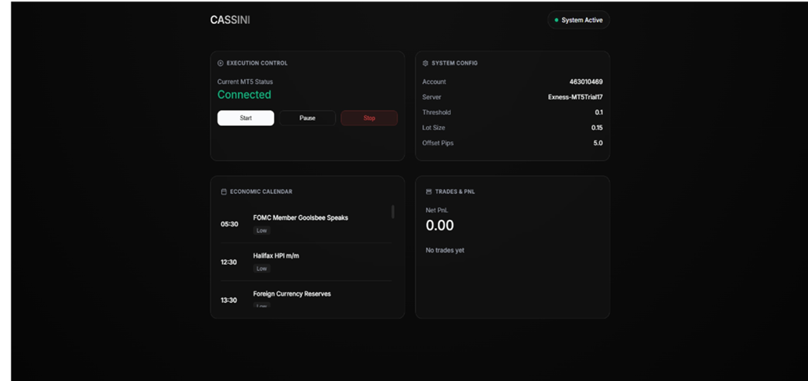

# CASSINI: Live NLP-Powered News Trading Bot



CASSINI is a fully automated trading bot that scrapes real-time economic news, analyzes it using a FinBERT NLP model, and executes trades directly on MetaTrader 5. The entire system is controlled and monitored through a sleek web-based dashboard.

## 🌟 Features
- **Real-time News Scraping:** Uses `undetected_chromedriver` to securely get live economic calendar data from Forex Factory.
- **NLP Sentiment Analysis:** Analyzes news headlines instantly using the FinBERT model to determine market sentiment.
- **Automated Trading:** Connects to an MT5 account (e.g., VantageMarkets, Exness) to place trades automatically based on news impact.
- **CASSINI Web Dashboard:** A beautiful Flask-powered UI to start/stop the bot, monitor your MT5 connection, view account stats, and track upcoming economic events.
- **Advanced Risk Management:** Configurable spread filters, symbol-specific stop-loss/take-profit, and offset pips.

---

## 📂 Project Structure
To run the bot successfully, your core directory should look like this:

```text
kairos/
│
├── live_bot.py                   # Main executable script (runs bot & web server)
├── advanced_stealth_scraper.py   # Web scraper for real-time news data
├── config.py                     # Configuration for MT5 credentials and risk settings
├── requirements.txt              # List of Python dependencies
├── forex_events.json             # (Optional) Fallback offline events data
├── dashboard.png                 # Dashboard screenshot
│
└── templates/                    
    └── dashboard.html            # Web dashboard UI (MUST be inside templates folder)
```

---

## 🚀 How to Run the Bot

### Step 1: Install Dependencies
Before running the bot for the first time, you need to install all the required Python libraries (like Flask, MetaTrader5, Transformers, etc.). Open your terminal, navigate to the project folder, and run:
```bash
pip install -r requirements.txt
```

### Step 2: Configure MetaTrader 5
Open the `config.py` file in a text editor and update your MT5 credentials:
```python
MT5_LOGIN = 12345678             # Your MT5 Account Number
MT5_PASSWORD = "YourPassword"    # Your MT5 Password
MT5_SERVER = "Your-Broker-Server" # e.g., "VantageMarkets-Demo"
```

### Step 3: Run the Bot
Once the dependencies are installed and your config is set, launch the bot by running:
```bash
python live_bot.py
```
*Note: The script will load the AI models and connect to MetaTrader 5 in the background.*

### Step 4: Access the Dashboard
The CASSINI dashboard should open automatically in your browser. If it doesn't, manually open your web browser and go to:
**http://127.0.0.1:5000**

From the dashboard, you can monitor your account balance, view the economic calendar, and control the bot's execution status!

---

## ⚠️ Important Notes
- **Templates Folder:** Flask requires your HTML files to be in a specific folder. Make sure `dashboard.html` is located inside a folder named `templates/`, or the dashboard will crash with a 500 error.
- **MetaTrader 5 Terminal:** MT5 must be installed on your Windows machine for the `MetaTrader5` python package to interact with it successfully.